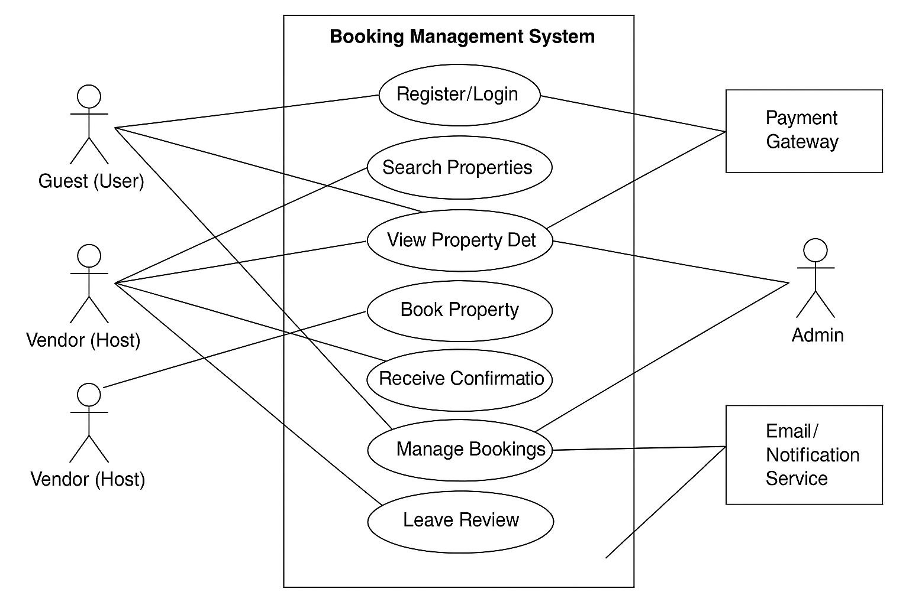

# Requirement Analysis in Software Development.
The Requirement Analysis Project focuses on crafting a comprehensive foundation for software development by documenting, analyzing, and structuring requirements. Through a series of well-defined tasks, learners will create a detailed blueprint of the requirement analysis phase for a booking management system. This project simulates a real-world development scenario, emphasizing clarity, precision, and structure in defining requirements to set the stage for successful project execution.

# What is Requirement Analysis?
Requirement Analysis is the first major phase of the SDLC where stakeholders’ needs are gathered, analyzed, and documented. It defines the project scope, ensures alignment with business goals, and reduces risks by catching issues early. The output—such as functional and non-functional requirements, use case diagrams, and acceptance criteria—serves as the blueprint for design, development, and testing. In short, Requirement Analysis defines what the system should do before building the how.

# Why is Requirement Analysis Important?
Defines scope – prevents scope creep by clarifying what’s included.
Aligns with business goals – ensures the system solves real problems.
Reduces risks – catches issues early before costly rework.
Guides development – provides the blueprint for design and coding.
Improves communication – keeps stakeholders and developers aligned.
Sets validation standards – enables clear testing and acceptance.

# Key Activities in Requirement Analysis
- Requirement Gathering
Collect stakeholder needs and expectations through interviews, surveys, and workshops.

- Requirement Elicitation
Refine and elaborate on gathered requirements using techniques like brainstorming, prototyping, and use case discussions.

- Requirement Documentation
Record requirements in clear, structured formats such as Software Requirement Specifications (SRS), use cases, and user stories.

- Requirement Analysis and Modeling
Organize and represent requirements with diagrams (e.g., use case diagrams, data flow diagrams) to understand system interactions and structure.

- Requirement Validation
Review requirements with stakeholders to ensure accuracy, completeness, and alignment with business objectives.

# Types of Requirements
** Functional Requirements

These define what the system should do — the core features and behaviors of the booking management system.

Examples for Booking Management System:

Users can search for available properties based on location, date, and price.

The system allows user registration and login.

Vendors can list and update property details (photos, descriptions, pricing).

Users can book a property and receive confirmation via email.

The system provides a payment gateway for secure transactions.

** Non-functional Requirements

These describe how the system should perform — the quality attributes that impact user experience and system reliability.

Examples for Booking Management System:

Performance: Search results must load in under 2 seconds.

Scalability: The system should support up to 10,000 concurrent users.

Security: User data and payment details must be encrypted.

Availability: The system should maintain 99.9% uptime.

Usability: The interface should be mobile-friendly and accessible.

# Use Case Diagrams

What they are:
Use Case Diagrams visualize how actors (users or external systems) interact with the system via use cases (goals/actions). They give a high-level, non-technical view of system scope and responsibilities.

Benefits:

- Clarifies scope and core user goals

- Aligns stakeholders with a shared visual

- Aids in spotting missing or redundant features

- Serves as a starting point for requirements, flows, and tests

- Booking System — Actors & Use Cases

Diagram Link: 

